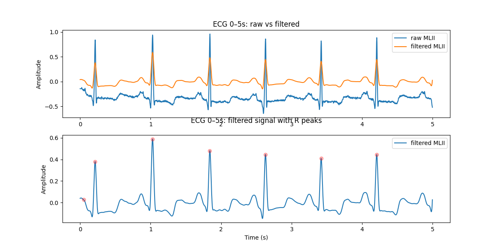

# ECG Data Exploration, Preprocessing and Machine Learning

This project focuses on **exploring/analyzing ECG data** with literature-backed methods with the **[MIT-BIH Arrhythmia Database (PhysioNet)](https://physionet.org/content/mitdb/1.0.0/)**. There is also focus on making these scripts more production ready in terms of how other teams can use the code developed. 

## Current stage:
- [ ] **Validate detected peaks with annotations as ground truth**

## Preprocessing
- [x] 0.5 - 30 Hz Filtering
- [x] Notch filtering
- [x] Detrend and baseline correction
- [x] R-peak Detection
    - [x] Write modules for Pam-Tompson QRS complex detection
    - [x] Calibrate peaks after detection
    - [ ] **Validate detected peaks with annotations as ground truth**

### Literature used:
- [Rahul Kher (2019) Signal Processing Techniques for Removing Noise from ECG Signals. J Biomed Eng 1: 1-9](https://www.jscholaronline.org/articles/JBER/Signal-Processing.pdf)
- https://martager.github.io/bbsig/ecg-preprocessing/

## Feature Engineering
- [ ]
- [ ]
- [ ]

## Data Analysis and Machine Learning
- [ ]
- [ ]
- [ ]

## Data app to view results
- [ ]
- [ ]
- [ ]

