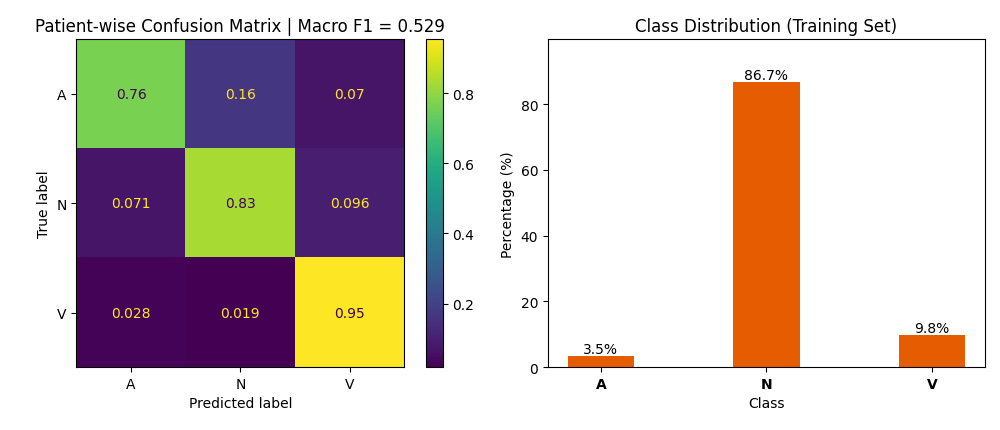

# ECG Data Exploration, Preprocessing and Machine Learning

This project focuses on **exploring/analyzing ECG data** with literature-backed methods with the **[MIT-BIH Arrhythmia Database (PhysioNet)](https://physionet.org/content/mitdb/1.0.0/)**. There is also focus on making these scripts more production ready in terms of how other teams can use the code developed. 

P.S: Setup and usage instructions coming soon

## Current stage => [Feature engineering / Machine Learning](#data-analysis-and-machine-learning):

Current insight: Gradient boosting with waveform + RR interval features reaches Macro F1 = 0.529. V beat recall is strong (0.95) but A beat precision remains low (0.14) due to class imbalance (A = 3.5% of training data). Next step: address imbalance.

## Preprocessing
- [x] 0.5 - 30 Hz Filtering
- [x] Notch filtering
- [x] Detrend and baseline correction
- [x] R-peak Detection
    - [x] Write modules for Pam-Tompson QRS complex detection
    - [x] Calibrate peaks after detection
    - [x] Validate detected peaks with annotations as ground truth

### Literature used:
- [Rahul Kher (2019) Signal Processing Techniques for Removing Noise from ECG Signals. J Biomed Eng 1: 1-9](https://www.jscholaronline.org/articles/JBER/Signal-Processing.pdf)
- https://martager.github.io/bbsig/ecg-preprocessing/

## Feature Extraction and Engineering
- [x] **Extract R peak waveforms and other key features**
- [x] **Build table with labels from annotations**
- [x] **Extract RR interval features** — pre/post RR, delta RR, RR ratio, local RR mean, deviation from local mean

### Literature used:
- https://inass.org/wp-content/uploads/2022/12/2023043016-2.pdf

## Data Analysis and Machine Learning
- [x] **Logistic regression with R waveforms only** — Macro F1 = 0.41
- [x] **Logistic regression with waveforms + RR features** — Macro F1 = 0.44
- [x] **Gradient boosting with waveforms + RR features** — Macro F1 = 0.529
- [ ] **Address class imbalance (SMOTE / oversampling)**
- [ ] **Morphology features (QRS width, amplitude, skewness)**

## Data app to view results
- [ ]
- [ ]
- [ ]