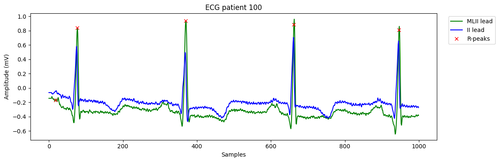

# ECG Data Exploration & Preprocessing

This project focuses on **exploring ECG data**, understanding beat-level annotations, and performing basic **signal preprocessing** using the **MIT-BIH Arrhythmia Database (PhysioNet)**.

Current work includes:
- Loading and inspecting raw ECG signals and annotation labels
- Visualizing beats across different channels (e.g. MLII, V5)
- Examining class distributions and preparing the data for potential machine learning experiments

