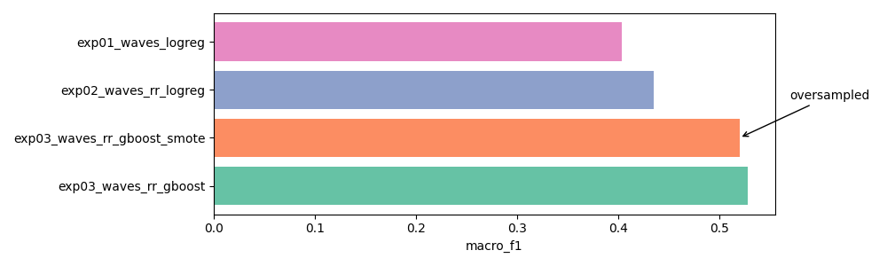

# ECG Data Exploration, Preprocessing and Machine Learning
This project focuses on **exploring/analyzing ECG data** with literature-backed methods with the **[MIT-BIH Arrhythmia Database (PhysioNet)](https://physionet.org/content/mitdb/1.0.0/)**. There is also focus on making these scripts more production ready in terms of how other teams can use the code developed. 
P.S: Setup and usage instructions coming soon
## Current stage => [Feature engineering / Machine Learning](#data-analysis-and-machine-learning):

Current insight: Added Wavelet features, and it seems to be adding noise and drops performance.
## Preprocessing
- [x] 0.5 - 30 Hz Filtering
- [x] Notch filtering
- [x] Detrend and baseline correction
- [x] R-peak Detection
    - [x] Write modules for Pam-Tompson QRS complex detection
    - [x] Calibrate peaks after detection
    - [x] Validate detected peaks with annotations as ground truth
### Literature used:
- [Rahul Kher (2019) Signal Processing Techniques for Removing Noise from ECG Signals. J Biomed Eng 1: 1-9](https://www.jscholaronline.org/articles/JBER/Signal-Processing.pdf)
- https://martager.github.io/bbsig/ecg-preprocessing/
## Feature Extraction and Engineering
- [x] **Extract R peak waveforms and other key features**
- [x] **Build table with labels from annotations**
- [x] **Extract RR interval features**: pre/post RR, delta RR, RR ratio, local RR mean, deviation from local mean
- [x] **Extract QRS morphology features**: Q-R interval, R-S interval, Q-R amplitude, R-S amplitude
- [x] **Extract wavelet features and use them with XGBoost**
### Literature used:
- https://inass.org/wp-content/uploads/2022/12/2023043016-2.pdf
## Data Analysis and Machine Learning
- [x] **Logistic regression with R waveforms only**: Macro F1 = 0.41
- [x] **Logistic regression with waveforms + RR features**: Macro F1 = 0.44
- [x] **Gradient boosting with waveforms + RR features**: Macro F1 = 0.529
- [x] **SMOTE oversampling**: Macro F1 = 0.520 (dropped: slowed training, no improvement)
- [x] **Feature ablation**: waves + RR + QRS outperforms subsets; QRS features add value
- [x] **XGBoost with waveforms + RR + QRS features**: Macro F1 = 0.577
- [ ] **XGBoost hyperparameter optimization**: randomized search with patient-wise CV
- [ ] **RR irregularity feature (coefficient of variation of RR intervals)**
## MLOps
- [x] **MLflow experiment tracking**: all runs tracked with metrics, parameters, and artifacts for reproducibility and comparison across experiments
- [x] **Config-driven experiments**: new experiments require only a config.yaml entry, no code changes
- [x] **Label encoding and artifact logging**: LabelEncoder saved as MLflow artifact for consistent eval

## Data app to view results
- [ ]
- [ ]

- [ ]
